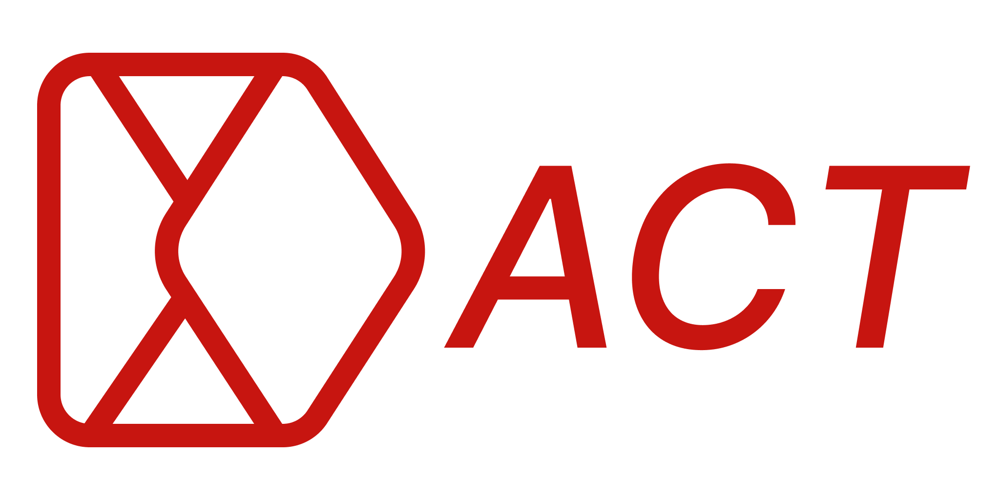

# ACT AI: Your Intelligent Task Automation Companion

## 🚀 Revolutionize Your Browsing Experience

ACT AI is not just another Chrome extension—it's your personal AI assistant that seamlessly integrates with your web browsing, identifying and automating tasks with unprecedented accuracy and efficiency.

### 🧠 Large Action Model + 👁️ Computer Vision = Magic ✨

Powered by a state-of-the-art Large Action Model (LAM) and advanced computer vision algorithms, ACT AI understands your intentions and automates complex web tasks, saving you countless hours of repetitive work.

## 🌟 Key Features

- **Intelligent Task Recognition**: ACT AI analyzes your browsing patterns and email content to identify actionable tasks.
- **Visual Understanding**: Our computer vision technology "sees" web pages like you do, understanding layouts, buttons, and interactive elements.
- **Adaptive Automation**: The more you use ACT AI, the better it gets at predicting and executing your common tasks.
- **Privacy-First Design**: Your data stays on your device. ACT AI's core functions work offline, ensuring your sensitive information remains private.
- **Cross-Site Automation**: Seamlessly perform tasks that span multiple websites and services.

## 🛠️ How It Works

1. **Observe**: ACT AI watches how you interact with websites.
2. **Learn**: It builds a model of common tasks and workflows.
3. **Suggest**: ACT AI offers to automate repetitive tasks it has identified.
4. **Execute**: With your approval, it performs complex sequences of actions across multiple sites.

## 🎭 Use Cases

- **E-commerce**: Automatically check for better deals across multiple sites.
- **Travel Planning**: Book flights, hotels, and activities with a single command.
- **Data Entry**: Fill out forms across different platforms in seconds.
- **Social Media Management**: Schedule and post content across various networks effortlessly.

## 🚀 Getting Started

1. Install ACT AI from the Chrome Web Store.
2. Grant necessary permissions for optimal functionality.
3. Start browsing! ACT AI will begin learning your patterns immediately.
4. Look for the ACT AI icon to light up when it detects an automatable task.

## 🛡️ Security & Privacy

We take your privacy seriously. ACT AI:
- Never stores your personal data on external servers.
- Uses end-to-end encryption for any necessary data transmission.
- Gives you full control over what tasks it can automate.

## 🌈 The Future of Web Interaction

ACT AI is more than just a tool—it's a glimpse into the future of human-computer interaction. As we continue to refine our AI models and expand our computer vision capabilities, the line between thought and action on the web will blur.

Join us in shaping this future. Your feedback and usage patterns help make ACT AI smarter for everyone.

## 🤝 Contributing

We welcome contributions! Check out our [Contributing Guide](CONTRIBUTING.md) to get started.

## 📜 License

ACT AI is released under the [MIT License](LICENSE).

---

Ready to supercharge your web browsing? [Install ACT AI Now!](chrome-web-store-link)

For support, contact us at support@actai.com

Remember: With great power comes great responsibility. Use ACT AI wisely! 🦸‍♂️🦸‍♀️
